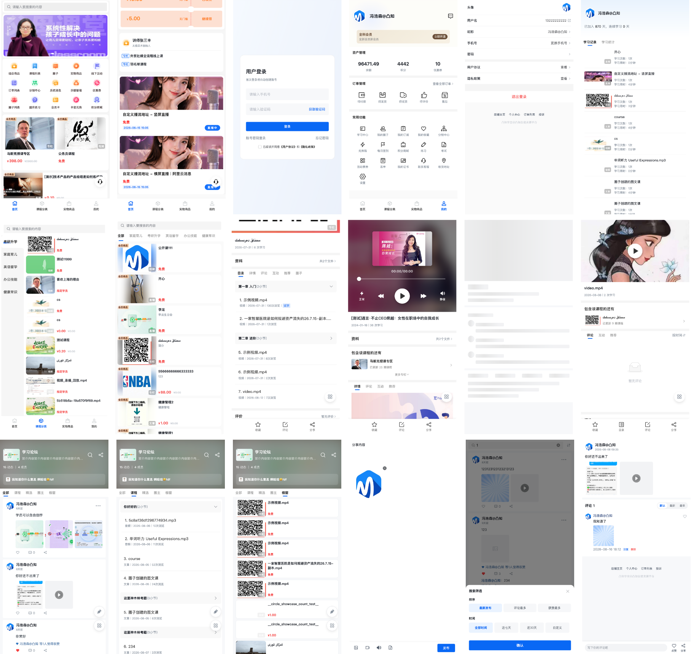
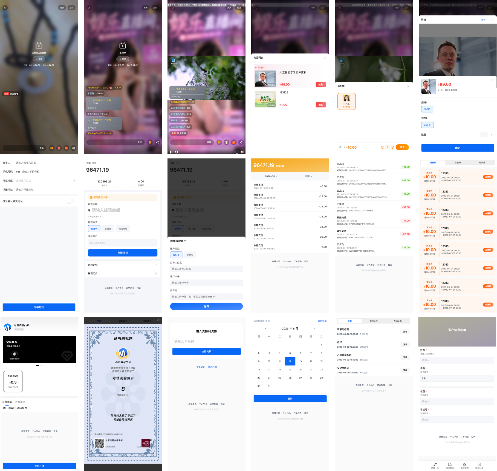
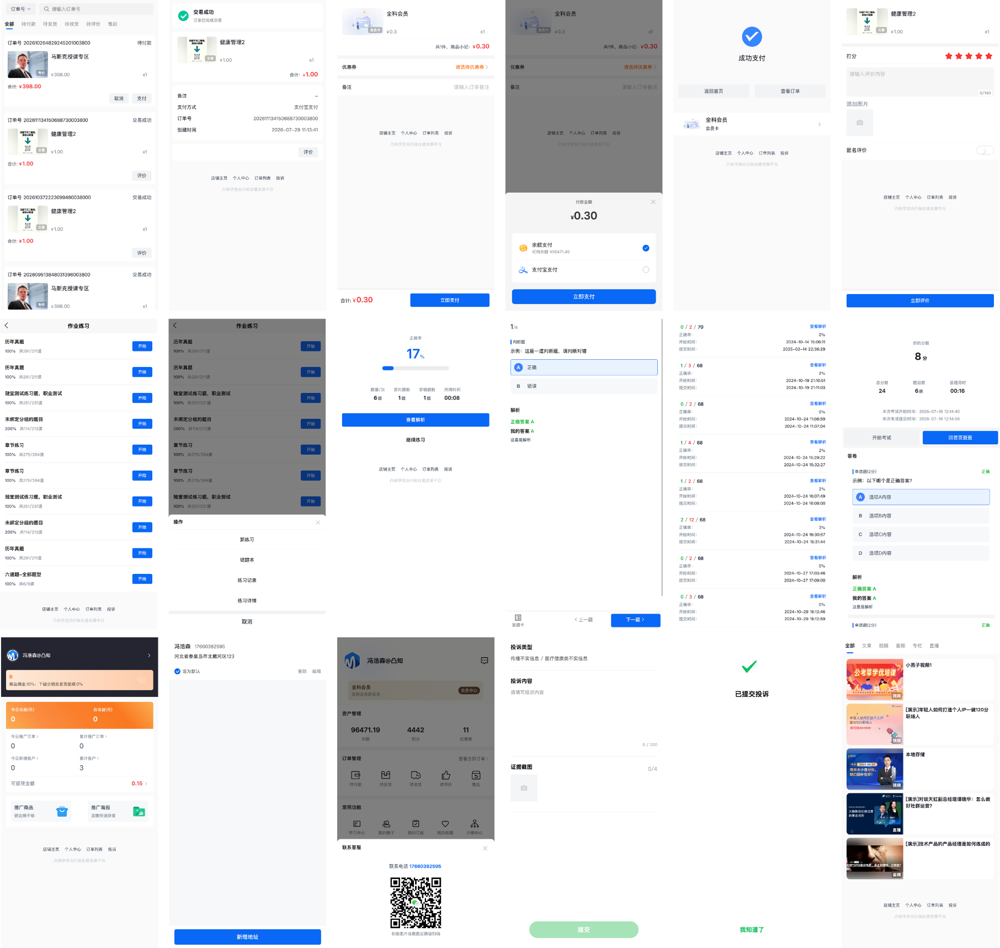
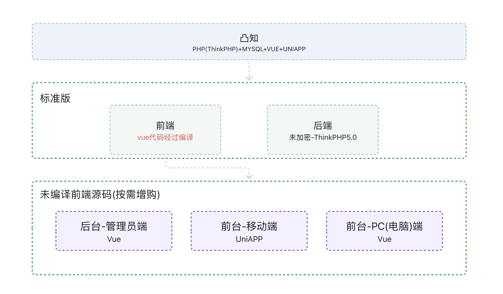

<h1 align="center">凸知移动端（Tuzi Mobile）</h1>

<h4 align="center">
  <a href="#一功能特性">功能特性</a> |
  <a href="#二系统架构">系统架构</a> |
  <a href="#四快速开始">快速开始</a> |
  <a href="#七目录结构">目录结构</a> |
  <a href="#九相关链接">相关链接</a> |
  <a href="#十一使用许可">使用许可</a>
</h4>

<p align="center">🎓 基于 uni-app 的多端知识付费移动端前端解决方案</p>

**凸知（Tuzhi）** 是一套完整的知识付费解决方案，支持**私有化部署**，覆盖课程售卖、直播授课、圈子社区、考试测评、分销营销、实物商品等完整业务场景，提供管理后台、移动端（H5 / 微信小程序）、PC 学员端等多端入口，帮助个人 IP、教培机构与品牌商家搭建自有卖课平台。

**凸知移动端** 是一款基于 uni-app（Vue 2）+ TDesign 开发的知识付费移动端前端，支持 **H5 / 微信小程序** 多端编译（**不支持 App 打包**）。覆盖课程点播、直播、专栏、圈子社区、订单支付（前端交互）、优惠券、余额红包、考试答题等完整学习场景。

**系统演示**：

| 端 | 演示地址 | 账号 | 密码 |
|----|----------|------|------|
| 后台 | https://tuzhi.mutouweb.com/admin.php | admin | 123456 |
| 移动端（用户） | https://tuzhi.mutouweb.com | 13222222222 | 123456 |
| PC 端（用户） | https://tuzhi.mutouweb.com/pc/#/ | 13222222222 | 123456 |

## 一、功能特性

- **终端覆盖**：电脑端 / 微信公众号（H5）/ 微信小程序多端学习
- **课程内容**：图文 / 视频 / 音频 / 专栏售卖，支持试看试听、课件资料与内容保护
- **互动教学**：练习 / 考试测评 / 题库 / 试卷库 / 证书 / 表单 / 圈子社区
- **直播能力**：直播授课 / 伪直播 / 回放 / 直播带货 / 送礼物 / 发红包
- **营销增长**：分销推广 / 优惠券 / 每日签到 / 积分商城 / 付费会员卡 / 组合商品 / 卡密兑换
- **实物商品**：商品管理 / 多规格 SKU / 限购设置 / 售后退换
- **交易支付**：购物车 / 订单管理 / 余额支付 / 微信支付 / 支付宝支付
- **用户数据**：用户管理 / 订阅记录 / 学习分析 / 交易分析 / 订单管理
- **系统安全**：页面 DIY 装修 / 云存储 / 短信与消息推送 / 管理员权限 / 版权保护（跑马灯 / 防录屏）

**界面预览**：

<p align="center">
  
</p>

<p align="center">
  
</p>

<p align="center">
  
</p>

## 二、系统架构

凸知是一套完整的知识付费系统，由四个部分组成：

| 部分 | 技术栈 | 说明 | 源码开放 |
|------|--------|------|----------|
| 后端服务 | ThinkPHP 5.0 + FastAdmin + MySQL | 接口服务，承载支付、直播、分销等全部业务逻辑 | 购买授权 |
| 移动端（本仓库） | uni-app（Vue 2）+ TDesign | H5 / 微信小程序学员端（不支持 App 打包） | 开源 |
| 管理后台 | Vue 3 + Arco Design | 管理员 / 讲师运营后台 | 购买授权 |
| PC 学员端 | Vue 3 + Arco Design | 电脑端学员学习页面 | 购买授权 |

凸知终端技术结构：

<p align="center">
  
</p>

整体调用链路：移动端 / PC 学员端 / 管理后台 → 后端接口服务（`{code, msg, data}` 协议）→ MySQL 数据库。

> 本仓库**仅开源移动端前端源码**；如需后端服务或管理后台等其余端的源码，需购买商业授权获取，详见「十一、使用许可」与[授权价格](https://www.tuzhi.ltd/index/pricing/version.html)。

## 三、技术栈

| 分类 | 技术 | 说明 |
|------|------|------|
| 跨端框架 | uni-app（Vue 2.x） | vue-cli 工程，一套代码编译 H5 / 微信小程序等多端（不支持 App 打包） |
| 开发语言 | JavaScript（Vue 2 语法）+ Sass | 页面按 `xxx.vue + js.vue + css.css` 三文件拆分，样式用 CSS 规则 |
| UI 组件库 | TDesign（`@tdesign/uniapp`） | 全局主题样式，小程序端内置构建适配补丁（`scripts/`） |
| | uView（本地 `components/uview-ui`） | 列表 / 弹窗 / 表单等通用组件 |
| | 自研 `components/tz/` | 音频 / 视频 / 媒体编辑 / 上传 / 文件预览等 45+ 业务组件 |
| | qiun-data-charts | 图表可视化 |
| 状态管理 | Vuex 3 | 全局登录态 / 用户信息等 |
| 国际化 | vue-i18n 8 | 内置 zh-CN / US 多语言 |
| 网络请求 | flyio + 自封装 `$api` | `$api('module.action')` 点分路由，统一鉴权 / 错误处理 / 401 跳转 |
| 音视频播放 | 阿里云播放器 Aliplayer（H5，本地化资源）、hls.js / flv.js | 直播与点播，支持倍速 / 弹幕 / 水印等组件 |
| 微信能力 | jweixin-module | 微信登录 / 分享 JS-SDK 封装 |
| 构建工具 | @vue/cli 5 + webpack | 由 `@dcloudio/vue-cli-plugin-uni` 驱动多端编译 |
| 测试 | Jest | 多端单元测试（`npm run test:*`） |

## 四、快速开始

**环境要求**：Node.js >= 14（建议 16/18）、npm

```bash
# ① 安装依赖
npm install

# ② H5 开发（默认不启用 Mock，对接真实后端；如需 Mock 见「Mock 数据」）
npm run dev:h5
```

浏览器访问 `http://localhost:8080` 即可看到完整页面效果。

**微信小程序编译**：

```bash
# ③ 小程序开发模式（监听编译，产物在 dist/dev/mp-weixin）
npm run dev:mp-weixin

# ④ 小程序生产构建（内置 TDesign 适配补丁，产物在 dist/build/mp-weixin）
npm run build:mp-weixin
```

用微信开发者工具「导入项目」选择对应产物目录（开发选 `dist/dev/mp-weixin`，生产选 `dist/build/mp-weixin`），并在 `src/manifest.json` 中替换为自己的 appid。

**对接真实后端**：

1. 修改 `src/siteinfo.js` 中的 `siteroot` 为你的后端地址；
2. 在 `src/common/request/api_list.js` 中核对接口地址与 `{code, msg, data}` 协议；
3. 微信小程序构建需在 `src/manifest.json` 中替换为自己的 appid。

## 五、构建

| 目标 | 命令 |
|------|------|
| H5 | `npm run build:h5` |
| 微信小程序 | `npm run build:mp-weixin` |

> 小程序构建内置 TDesign 适配补丁（`scripts/`），构建成功后产物在 `dist/build/` 下。
>
> ⚠️ 注意：当前版本**不支持 App 打包**，仅支持 H5 与微信小程序两个平台。

## 六、Mock 数据

- H5 开发模式（`NODE_ENV=development`）**默认关闭**，全部走真实后端接口；
- 开启方式：将 `src/static/config.js` 的 `enableMock` 改为 `true`（显式设置优先级最高），或通过 `uni.setStorageSync('enableMock', true)` / 环境变量 `MOCK_ENABLE` 切换；
- 覆盖 200+ 接口，fixture 位于 `src/mock/data/`，按 `module/action` 路由镜像；
- 未覆盖的接口自动透传真实网络并输出提示；
- Mock 数据由仓库内 mock-crawler 工具采集真实后端响应生成，发布前已做敏感字段脱敏（token/openid/手机号等）。

## 七、目录结构

```
src/
├── pages/        页面（index 主包 + public/app/user/order/course 五个分包，约 100+ 页面）
│   ├── index/        首页（主包唯一页面，tabBar 入口）
│   ├── launch/       启动页（加载与参数透传跳转，未在 pages.json 注册）
│   ├── public/       公共分包：登录 / 注册 / 找回密码 / 协议 / 搜索 / 消息 / 结果页等
│   ├── app/          业务功能分包：活动 / 圈子 / 考试 / 优惠券 / 积分 / 签到 / 证书 / 分销 / 直播带货等
│   ├── user/         用户分包：个人中心 / 资产 / 余额 / 地址 / 收藏 / 学习记录 / 订阅 / 红包等
│   ├── order/        订单分包：订单列表 / 详情 / 提交 / 评价 / 售后 / 物流等
│   ├── course/       课程分包：课程详情 / 分类 / 专栏 / 小组 / 直播等
│   └── template/     页面模板（新建页面的三文件拆分参考，未在 pages.json 注册）
├── components/   组件（tz/ 自研组件库、uview-ui、qiun-data-charts、视频播放器等）
├── common/       公共层
│   ├── request/  接口封装（$api 点分路由、统一鉴权/错误处理）
│   ├── utils/    工具（路由映射、支付、直播、OSS 签名等）
│   ├── order/    订单状态处理
│   └── wechat/   微信登录/分享 SDK 封装
├── mock/         Mock 数据（H5 开发模式默认关闭，开启方式见「六、Mock 数据」）
├── static/       静态资源
├── pages.json    页面路由与分包配置
└── manifest.json 应用配置（appid 等）
```

## 八、开发约定

- 页面采用 `xxx.vue + js.vue + css.css` 三文件拆分（`<script src="./js.vue">` + `@import "./css.css"`），逻辑与样式分离；
- 接口调用统一走 `this.$api('module.action', data)`，登录态、401 跳转、错误提示由拦截器统一处理；
- 业务组件优先复用 `components/tz/` 自研组件库；
- 提交信息遵循 Conventional Commits（`feat:` / `fix:` / `chore:`）。

## 九、相关链接

| 名称 | 链接 |
|------|------|
| 使用文档 | https://wood-soft.feishu.cn/wiki/KKLkwOPBHiButJkTluTcoXKenjh |
| 功能列表 | https://wood-soft.feishu.cn/wiki/YGFYw0k8PiJDWxketgHcBNKNnxe |
| 授权价格 | https://www.tuzhi.ltd/index/pricing/version.html |
| 功能演示 | https://www.tuzhi.ltd/index/demo/index.html |

## 十、软件安全

安全问题请通过 Issue（需注明"安全"）或邮件私下报告给项目维护团队，请勿在公开渠道描述可利用的漏洞细节。我们将在确认后尽快修复并同步发布。

## 十一、使用许可

- 本软件遵循 **凸知开源协议 V1.0**（非商业用途免费，商业用途需购买商业授权），详见 [LICENSE](./LICENSE)；
- 第三方组件许可声明见 [THIRD-PARTY-NOTICES.md](./THIRD-PARTY-NOTICES.md)；
